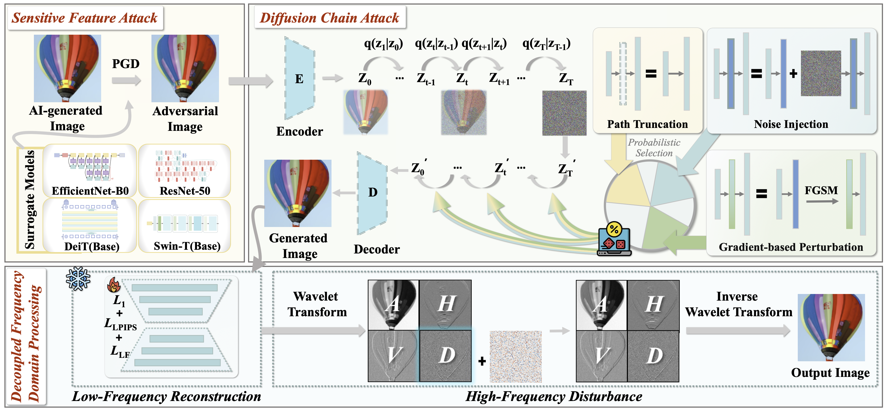
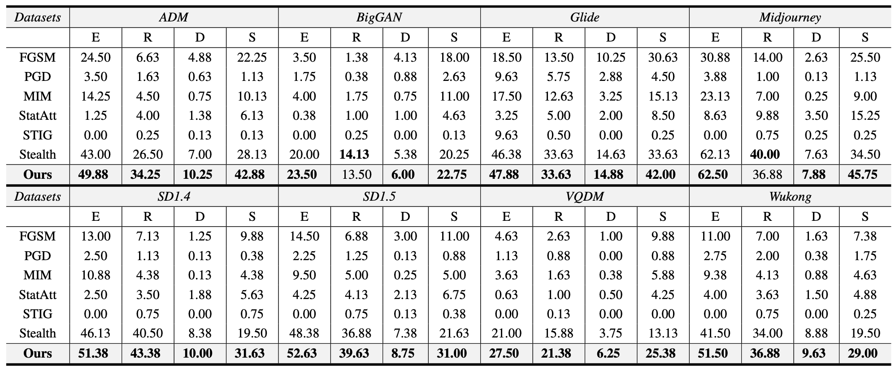
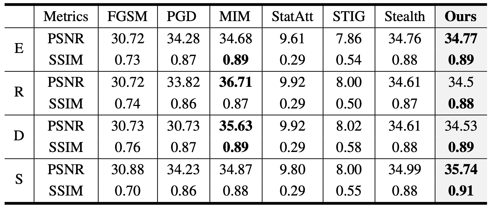

<a id="top"></a>
<div align="center">
  <h1>🕵️‍♂️ (TDSC 2026) ERASE: Bypassing Collaborative Detection of AI Counterfeit via Comprehensive Artifacts Elimination</h1>
<p>
    <b>Qianyun Yang</b><sup>1</sup>&nbsp;
    <b>Peizhuo Lv</b><sup>2</sup>&nbsp;
    <b>Yingjiu Li</b><sup>3</sup>&nbsp;
    <b>Shengzhi Zhang</b><sup>4</sup>&nbsp;
    <b>Yuxuan Chen</b><sup>1</sup>&nbsp;
    <b>Zixu Li</b><sup>1</sup>&nbsp;
    <b>Yupeng Hu</b><sup>1</sup>
  </p>

  <p>
    <sup>1</sup>Shandong University&nbsp;
    <sup>2</sup>Nanyang Technological University&nbsp;
    <sup>3</sup>University of Oregon&nbsp;&nbsp
    <sup>4</sup>Boston University
  </p>
  
  <p>
    <a href="#"></a>
    <a href="#"></a>
    <a href="#"></a>
    <a href="https://pytorch.org/get-started/locally/"></a>
    
  </p>

  <p>
    <b>Accepted by IEEE TDSC 2026:</b> An optimization framework inspired by real-world "antique painting forgery" techniques, designed to bypass both <b>single and collaborative detection of AI-Generated Images (AIGI)</b> by comprehensively eliminating multi-dimensional generative artifacts.
  </p>
</div>

## 📖 Introduction

With the rapid development of generative AI (e.g., Stable Diffusion, GANs), the issue of deepfakes generated by AI has become increasingly severe. Existing **AI-Generated Image Stealth (AIGI-S)** methods typically optimize against a single detector and often fail when facing "Collaborative Detection" widely used in real-world scenarios. Moreover, images processed by these methods frequently contain obvious artifacts visible to human observers.

**ERASE (comprehensive counterfeit ArtifactS Elimination)** is a stealth optimization framework designed for multi-detector environments. We innovatively combine a **Sensitive Feature Attack**, an optimization-free **Diffusion Chain Attack**, and **Decoupled Frequency Domain Processing**. It comprehensively suppresses generative artifacts while maintaining exceptionally high visual fidelity. Extensive experiments show that ERASE improves the single-detector evasion rate by **+10.5%** on average and the collaborative detection evasion rate by **+17.9%**.

[⬆ Back to top](#top)

## 📢 News
- **[2026-03-23]** 🚀 Released the streamlined core attack logic of ERASE.
- **[2026-03-23]** 🔥 Our paper *"ERASE: Bypassing Collaborative Detection of AI Counterfeit via Comprehensive Artifacts Elimination"* has been accepted by **IEEE TDSC 2026**!

[⬆ Back to top](#top)

## ✨ Key Features

- 🎯 **Sensitive Feature Attack**: Utilizes gradient-based adversarial attacks to precisely perturb detector-sensitive pixels, transforming perceptible artifacts into misleading features.
- ⛓️ **Diffusion Chain Attack**: The industry's first "optimization-free" diffusion reconstruction paradigm. Coupled with a "Probabilistic Processing Gate" mechanism, it disrupts generative artifacts without introducing new feature anomalies.
- 📻 **Decoupled Frequency Domain Processing**: Decouples low-frequency reconstruction (preserving semantics) and high-frequency perturbation (removing artifacts) to simulate the natural frequency characteristics of real images, greatly enhancing human visual deception.
- 🧩 **Streamlined & Scalable Framework**: The open-source version removes 68% of redundant experimental code, retaining only the core attack logic. It is ready to use out-of-the-box and highly compatible with the evaluation settings of [StealthDiffusion](https://github.com/wyczzy/StealthDiffusion).

[⬆ Back to top](#top)

## 🏗️ Architecture

<p align="center">

  <figcaption><strong>Figure 1.</strong> ERASE consists of three core modules: (a) Sensitive Feature Attack embedding adversarial priors; (b) Diffusion Chain Attack reconstructing the image and breaking determinism via a probabilistic gate mechanism; (c) Decoupled Frequency Domain Processing eliminating frequency artifacts in deep structures.</figcaption>
</p>

[⬆ Back to top](#top)

## 🏃‍♂️ Experiment Results

### Collaborative Detection Performance
When facing a 7-model collaborative detector composed of CNNSpot, FreDect, GramNet, LGrad, Fusing, DRCT, and UnivFD, the attack success rate of most existing methods plummets to less than 10%, whereas **ERASE is the only method to exceed a 30% average success rate**.

<caption><strong>Table 1.</strong> Attack success rates (%) of AIGI-S methods against the joint detector, evaluated across four surrogate models and eight datasets. The best results are highlighted in bold.</caption>



<p align="center">
  </p>

### Visual Quality Comparison
Compared to traditional adversarial attacks and other AIGI-S methods, ERASE achieves SOTA in the SSIM metric (peak 0.91), rendering the perturbations practically imperceptible to the human eye.


<caption><strong>Table 2.</strong> PSNR and SSIM metrics for images processed by various AIGI-S methods. The first column denotes the surrogate model used. The best results are highlighted in bold.</caption>
<p align="center">

  </p>


<p align="center">
  </p>

[⬆ Back to top](#top)

## Table of Contents

- [Introduction](#-introduction)
- [Key Features](#-key-features)
- [Quick Start & Installation](#-quick-start--installation)
- [Repository Structure](#-repository-structure)
- [Data Preparation](#️-data-preparation)
- [Model Weights](#-model-weights)
- [Running the Attack](#️-running-the-attack)
- [Citation & Acknowledgements](#️-citation--acknowledgements)

---

## 🚀 Quick Start & Installation

We recommend using Anaconda to manage your environment. This project was developed and tested with Python 3.8+ and PyTorch 2.0.0+.

```bash
# 1. Clone the repository
git clone https://github.com/QianyunYang/ERASE
cd ERASE

# 2. Create a virtual environment
conda create -n erase python=3.9 -y
conda activate erase

# 3. Install dependencies (including Diffusers, Transformers, etc.)
pip install -r requirements.txt
```

[⬆ Back to top](#top)

## 📂 Repository Structure

The current open-source version has removed redundant experimental code (reducing codebase size by 68%), featuring a clean structure highly focused on the core logic of ERASE:

```text
ERASE/
├── main.py                                  # ▶️ Main entry point handling CLI arguments & workflow
├── Diffusion_chain_attack.py                # 🧠 Core architecture: Diffusion chain reconstruction & Probabilistic Gate
├── other_attacks.py                         # ⚔️ Model loading & Sensitive Feature Attack (PGD) logic
├── Frequency_Domain_Processing_low.py       # 📻 Decoupled Frequency Domain module (Low-freq recon & High-freq perturbation)
├── network.py                               # 🕸️ Backbone network implementations (e.g., ResNet50)
├── loggers.py                               # 📝 Formatted logging utilities
├── utils.py                                 # 🧰 General utilities (Image I/O, PSNR/SSIM calculation)
├── distances.py                             # 📏 Distance metric loss functions (L2, LPIPS)
├── dataset_caption/                         # 🏷️ Dataset label processing
│   └── ours_label.py
└── checkpoints/                             # 📦 Directory for pre-trained weights
    ├── Controlvae.pt                        # Frequency VAE weights
    └── ckpt_ori/                            # Surrogate model weights (E/R/D/S)
```

[⬆ Back to top](#top)


## 🗃️ Data Preparation

Our experiments are primarily conducted on the [GenImage](https://github.com/GenImage-Dataset/GenImage) dataset (following the task settings of [StealthDiffusion](https://github.com/wyczzy/StealthDiffusion)). Please organize your input directory (`images_root`) according to the following structure:

```text
input_images/
├── class_0/             # e.g., Real Images
│   ├── image_001.png
│   └── ...
└── class_1/             # e.g., AI-Generated Images (Fake / SDv1.4 / Midjourney, etc.)
    ├── image_001.png
    └── ...
```

[⬆ Back to top](#top)

## 📦 Model Weights

Before running the code, you need to prepare the following three types of model weights:

### 1\. Surrogate Classifier Weights

Create a directory in the project root and place the classifier weights (which can be trained on GenImage or obtained from [Google Drive](https://drive.google.com/drive/folders/15_a9NAAxkydYIVskIMKq6sopCRWd7MMX?usp=sharing)):

```bash
mkdir -p checkpoints/ckpt_ori
```

Required weight files: `resnet50.pth`, `efficientnet-b0.pth`, `deit.pth`, `swin-t.pth`.

### 2\. Frequency Domain Encoder (ControlVAE)

Place the low-frequency reconstruction VAE model weights `Controlvae.pt` into the `checkpoints/` directory.

### 3\. Stable Diffusion v2.1 Model

The code will automatically load `stabilityai/stable-diffusion-2-1-base` from HuggingFace during the diffusion chain attack. If you need to run offline, download it locally via:

```bash
huggingface-cli download stabilityai/stable-diffusion-2-1-base --local-dir ./weights/sd-2.1-base
```

[⬆ Back to top](#top)


## 🏋️‍♂️ Training the VAE (Encouraged)

If you wish to train your own low-frequency reconstruction VAE instead of using the pre-trained weights, run the following command. Please replace the paths with your local dataset directory and the desired output path to save the checkpoints:

```bash
python3 train_VAE_for_LowFrequency.py \
  --dir /path/to/your/dataset \
  --save_dir /path/to/save/checkpoints
```

[⬆ Back to top](#top)


## ▶️ Running the Attack

After preparing the environment and data, use `main.py` to launch the attack and generate adversarial examples. We have consolidated complex configurations into simple command-line arguments.

### Standard Execution Command

```bash
python main.py \
    --images_root ./input_images \
    --save_dir ./output \
    --model_name E,R,D,S \
    --diffusion_steps 20 \
    --start_step 18 \
    --iterations 10 \
    --is_encoder 1 \
    --encoder_weights ./checkpoints/Controlvae.pt \
    --eps 4 \
    --batch_size 4 \
    --device cuda:0
```

> **💡 Parameter Definitions:**
>
>   - `--model_name E,R,D,S`: Surrogate models to combine (E=EfficientNet, R=ResNet50, D=DeiT, S=Swin-T).
>   - `--diffusion_steps`: Total sampling steps for DDIM.
>   - `--start_step`: The truncation step where the diffusion chain starts the attack (closer to total steps = smaller perturbation, higher fidelity).
>   - `--iterations`: Iterations for Sensitive Feature Attack in the latent space.
>   - `--is_encoder`: Set to `1` to enable the Decoupled Frequency Domain Processing module.

### Viewing Outputs

Once finished, the generated adversarial images and logs will be saved in your `save_dir`:

  - `/output/adversarial/`: Contains the adversarial samples capable of bypassing detection.
  - `/output/metrics.json`: Contains attack success rates and perceptual metrics like PSNR/SSIM.

[⬆ Back to top](#top)


## 📝⭐️ Citation & Acknowledgements

### Citation

If you find our code useful or our work helpful for your research, please consider leaving a **Star** ⭐️ and citing our paper:

```bibtex
@article{yang2026erase,
  title={ERASE: Bypassing Collaborative Detection of AI Counterfeit via Comprehensive Artifacts Elimination},
  author={Yang, Qianyun and Lv, Peizhuo and Li, Yingjiu and Zhang, Shengzhi and Chen, Yuxuan and Chen, Zhiwei and Li, Zixu and Hu, Yupeng},
  journal={IEEE Transactions on Dependable and Secure Computing},
  year={2026},
  publisher={IEEE}
}
```

### Acknowledgements

The underlying evaluation mechanisms and partial structure of this project were inspired by [StealthDiffusion](https://github.com/wyczzy/StealthDiffusion). We salute their excellent open-source work\! We also thank the HuggingFace team for their robust `diffusers` library.

### Disclaimer

⚠️ **Important Notice**: This tool is strictly intended for academic research, AI security evaluation, and robustness testing. It is strictly prohibited to use it for any malicious forgery, fraud, or other illegal/unethical purposes. Users bear full legal responsibility for any consequences arising from improper use.

[⬆ Back to top](#top)

## 📄 License

This project is released under the terms of the [LICENSE](./LICENSE) file included in this repository.
